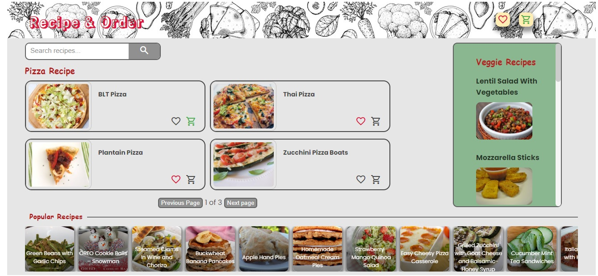
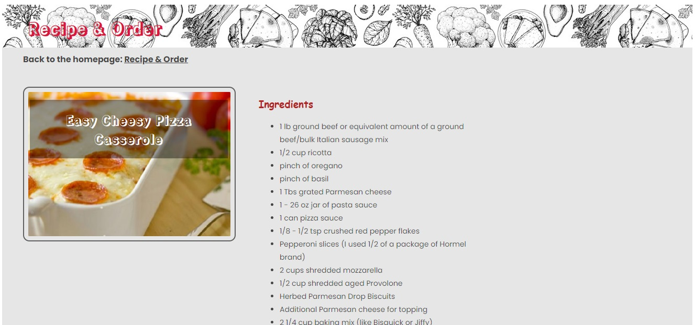

# ReactJS-Recipe-Fetcher (<font size='3'> V1 </font>)

#### By _**Mahashi-github**_

#### This is a ReactJS recipe-fetcher application. The app fetches recipes from 'Spoonacular API'. There are different recipe sections; popular recipes, veggies, pizzas and a section for searching recipes. Each section has a different presentation; popular section has sliding effect using Framer Motion animation library, searched recipes has pagination presentation and veggies section has random recipes.  

You can also like recipes and add them to the shopping list. Items can be also deleted from both lists. 

## Technologies Used
* _ReactJS_
* _React-router-dom_
* _React-Hooks (useContext, useEffect, useState)_
* _css_
* _jsx_
* _JSON-Server_
* _framer-motion_

## Setup
This react app is created by 'npm create vite@latest directoryName'. 

To run this project, install it locally:

First terminal:
```
$ npm install
$ npm run dev
```
Second terminal:
```
$ npx json-server -w data/db.json -p 8000
```

## Screenshots of the Application
<p>
  
  
</p>